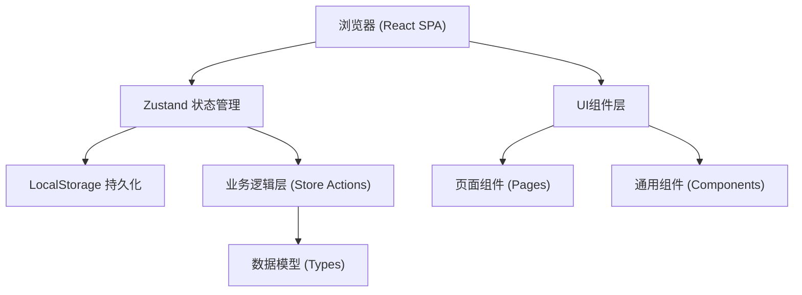
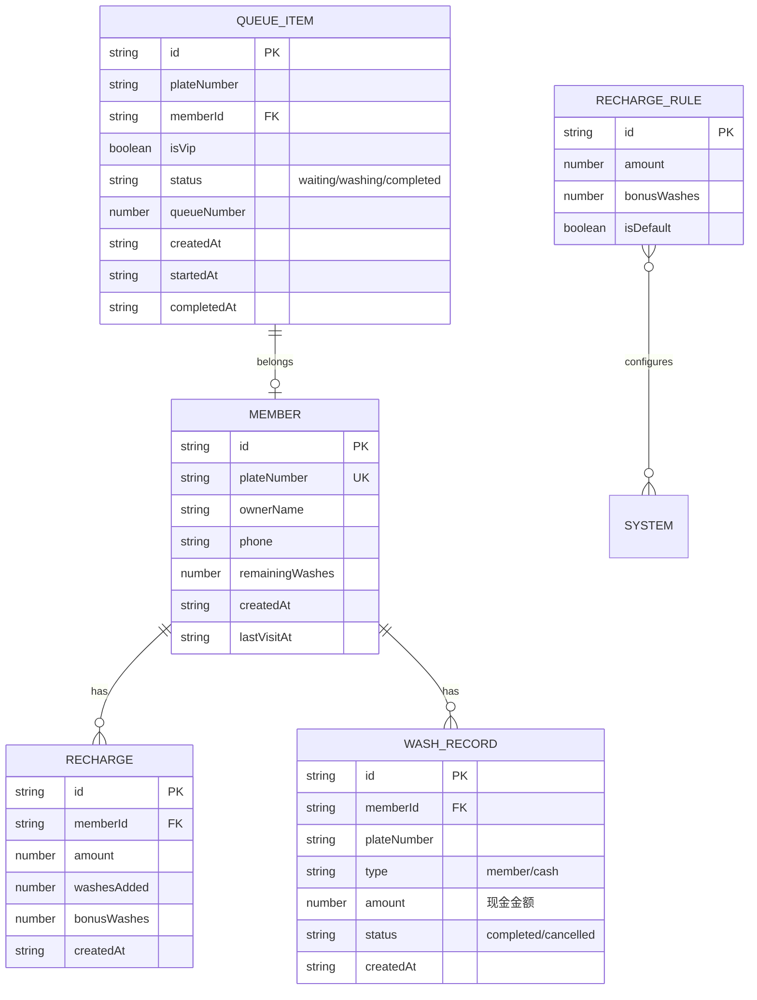

## 1. 架构设计



## 2. 技术描述
- **前端框架**：React@18 + TypeScript
- **构建工具**：Vite@5
- **状态管理**：Zustand@4
- **路由**：React Router DOM@6
- **样式方案**：TailwindCSS@3
- **图标库**：Lucide React
- **数据持久化**：LocalStorage（单机应用，无需后端）
- **初始化工具**：vite-init 模板 react-ts

## 3. 路由定义
| 路由 | 页面用途 |
|-------|---------|
| / | 仪表盘 - 今日数据概览和快捷操作 |
| /queue | 排队叫号 - 车辆排队管理、叫号、完成处理 |
| /members | 会员管理 - 会员列表、新增、充卡、详情 |
| /statistics | 统计报表 - 每日统计、会员统计、数据图表 |
| /settings | 系统设置 - 充值规则、提醒阈值配置 |

## 4. 数据模型

### 4.1 数据模型定义



### 4.2 数据结构定义 (TypeScript)

```typescript
// 会员
interface Member {
  id: string;
  plateNumber: string;
  ownerName: string;
  phone?: string;
  remainingWashes: number;
  totalWashes: number;
  createdAt: string;
  lastVisitAt?: string;
}

// 充值记录
interface RechargeRecord {
  id: string;
  memberId: string;
  amount: number;
  washesAdded: number;
  bonusWashes: number;
  createdAt: string;
}

// 洗车记录
interface WashRecord {
  id: string;
  memberId?: string;
  plateNumber: string;
  type: 'member' | 'cash';
  amount: number;
  status: 'completed' | 'cancelled';
  createdAt: string;
}

// 排队项
interface QueueItem {
  id: string;
  plateNumber: string;
  memberId?: string;
  isVip: boolean;
  status: 'waiting' | 'washing' | 'completed';
  queueNumber: number;
  createdAt: string;
  startedAt?: string;
  completedAt?: string;
}

// 充值规则
interface RechargeRule {
  id: string;
  amount: number;
  bonusWashes: number;
  isDefault: boolean;
}

// 系统配置
interface SystemConfig {
  lowWashThreshold: number;
  washDurationMinutes: number;
  cashPrice: number;
}
```

## 5. 状态管理设计 (Zustand Store)

### Store 模块划分：
1. **useMemberStore** - 会员管理：增删改查、充卡、搜索
2. **useQueueStore** - 排队管理：取号、叫号、VIP优先、完成处理
3. **useStatsStore** - 统计数据：按日统计、计算汇总
4. **useConfigStore** - 系统配置：充值规则、提醒阈值

### 关键业务逻辑：
- 车牌号取号时自动匹配会员
- 队列排序：VIP会员优先于散客，同类型按取号时间排序
- 洗车完成：会员扣1次，散客记录现金收入
- 剩余次数预警：低于阈值时标红提醒
- 数据持久化：所有store变化自动同步到LocalStorage

