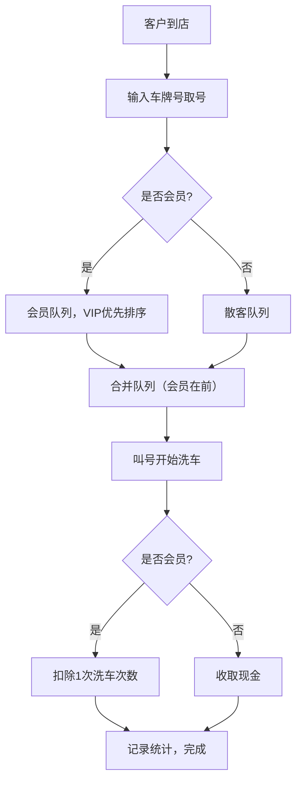

## 1. 产品概述
洗车店会员管理与排队叫号系统，专为小型洗车店设计，解决会员充卡管理、排队叫号、每日营收统计等核心业务痛点。
- 目标用户：小型洗车店老板/店员
- 核心价值：提升运营效率，简化会员管理，优化客户排队体验

## 2. 核心功能

### 2.1 用户角色
| 角色 | 注册方式 | 核心权限 |
|------|----------|----------|
| 店主/店员 | 无需注册，单机使用 | 全部功能操作权限 |

### 2.2 功能模块
1. **仪表盘/首页**：今日数据概览、快捷操作入口
2. **排队叫号**：取号、VIP优先、叫号、洗车完成处理
3. **会员管理**：会员列表、新增会员、会员充卡、剩余次数查询
4. **统计报表**：每日洗车统计、会员消费统计、现金收入统计
5. **系统设置**：充值规则配置、提醒阈值设置

### 2.3 页面详情
| 页面名称 | 模块名称 | 功能描述 |
|-----------|-------------|---------------------|
| 仪表盘 | 数据概览卡片 | 今日洗车数、会员洗车数、现金收入、待洗车辆数 |
| 仪表盘 | 快捷操作 | 快速取号、会员查询、新增会员快捷入口 |
| 排队叫号 | 排队列表 | 显示所有排队车辆，按VIP优先排序 |
| 排队叫号 | 取号操作 | 输入车牌号取号，自动识别会员/散客 |
| 排队叫号 | 叫号/完成 | 叫号提醒、洗车完成扣款/收现 |
| 排队叫号 | VIP优先 | 将会员车辆插队到散客前面 |
| 会员管理 | 会员列表 | 展示所有会员，支持搜索、筛选剩余次数不足 |
| 会员管理 | 新增会员 | 录入车牌号、车主姓名、手机号 |
| 会员管理 | 会员充卡 | 选择充值档位，自动赠送洗车次数 |
| 会员管理 | 会员详情 | 查看消费记录、剩余次数、充值历史 |
| 统计报表 | 每日统计 | 按日统计洗车量、会员占比、现金收入 |
| 统计报表 | 会员统计 | 会员活跃度Top排行、剩余次数预警名单 |
| 系统设置 | 充值规则 | 自定义充X元送Y次的规则 |
| 系统设置 | 提醒设置 | 设置剩余次数不足的提醒阈值 |

## 3. 核心流程

### 3.1 洗车流程
客户到店 → 店员输入车牌号取号 → 系统识别会员/散客 → 加入排队队列（会员优先）→ 叫号开始洗车 → 洗车完成 → 会员扣次/散客收现 → 记录统计

### 3.2 会员充卡流程
选择会员 → 选择充值档位（或自定义）→ 确认充值 → 系统按规则赠送洗车次数 → 更新会员余额 → 记录充值历史

## 4. 用户界面设计

### 4.1 设计风格
- **主色调**：深海蓝 (#0EA5E9)，代表水、清洁、专业
- **辅助色**：金色 (#F59E0B)，代表VIP、尊贵
- **成功色**：翠绿 (#10B981)
- **警告色**：橙红 (#F97316)
- **中性色**：石板灰系列 (slate-50 到 slate-900)
- **按钮风格**：圆角中等 (rounded-lg)，带微妙阴影，悬停上浮效果
- **字体**：标题用现代无衬线字体，正文清晰易读
- **布局风格**：卡片式布局，左侧导航栏 + 右侧主内容区
- **图标**：使用 Lucide 图标库，线条风格

### 4.2 页面设计概述
| 页面名称 | 模块名称 | UI元素 |
|-----------|-------------|----------|
| 仪表盘 | 数据概览卡片 | 渐变背景卡片，大数字展示，动画计数效果 |
| 排队叫号 | 排队卡片 | 车牌号大字展示，VIP金色标签，状态徽章 |
| 排队叫号 | 取号模态框 | 车牌号输入框，会员识别提示，确认按钮 |
| 会员管理 | 会员卡片 | 头像占位，剩余次数进度条，充值按钮 |
| 统计报表 | 图表区域 | 柱状图/折线图展示每日趋势，卡片汇总 |
| 系统设置 | 规则列表 | 可编辑的规则行，添加/删除按钮 |

### 4.3 响应式
- 采用桌面优先设计，适配1280px以上屏幕
- 平板端自适应，侧边栏可折叠
- 支持触摸操作，按钮尺寸适合点击

